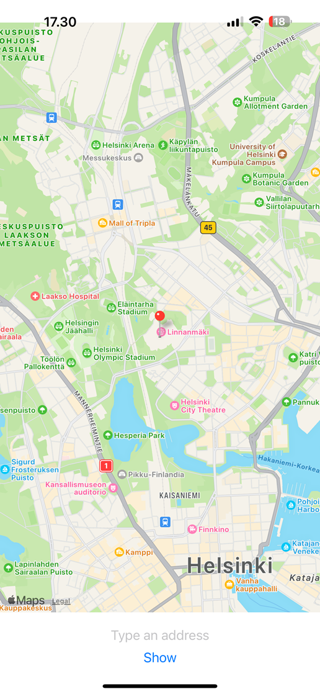
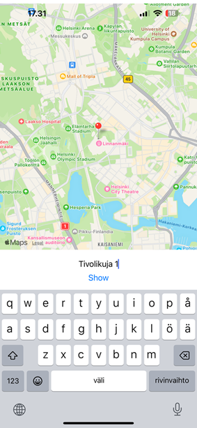
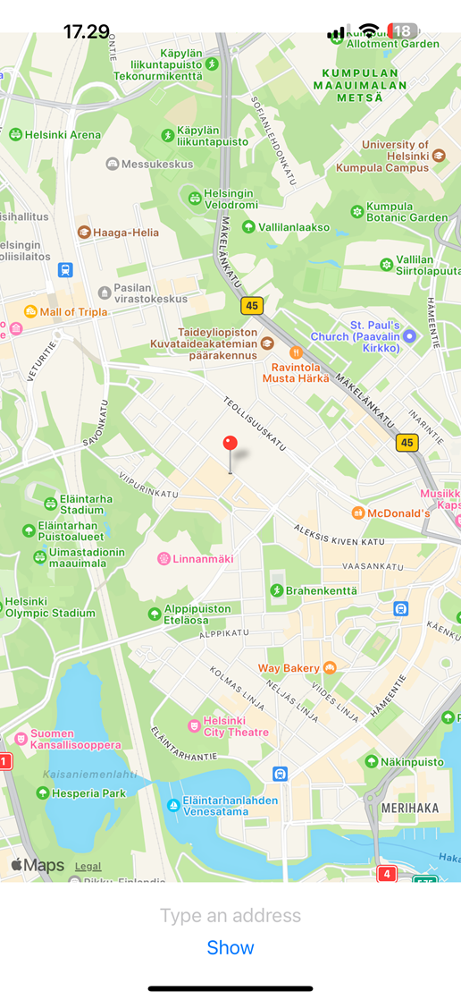
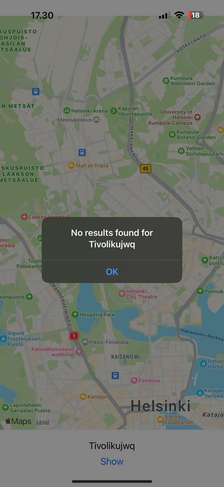

### Map app  
Mobile map app that utilizes [React Native Maps](https://github.com/react-native-maps/react-native-maps) and [Geocoding API](https://geocode.maps.co/). User may give either address or place name (eg. "Linnanmäki amusement park") and the location will be rendered on the map. If the given address does not exist, the user is alerted.

#### Screenshots  
 
  
 
 
