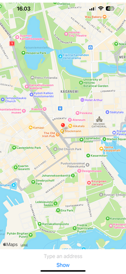
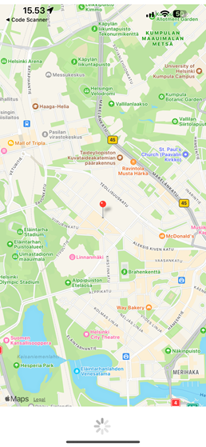
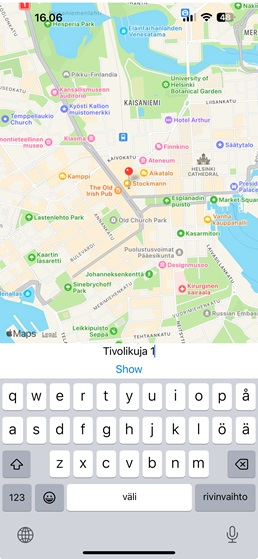
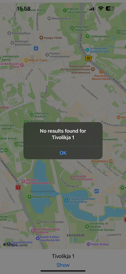
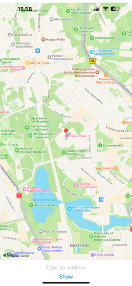

### Map app  
Mobile map app that utilizes [React Native Maps](https://github.com/react-native-maps/react-native-maps) and [Geocoding API](https://geocode.maps.co/). User may give either address or place name (eg. "Linnanmäki amusement park") and the location will be rendered on the map. If the given address does not exist, the user is alerted.

#### Screenshots  
If user gives permission for location data, app renders users location on the map on first load
  
  
While app is fetching coordinates, activity indicator is rendered  
  

User can search places or addresses  
  
  
If user misstypes the address, alert pops up  
  
  
Given address is rendered on the map with a marker.  
  